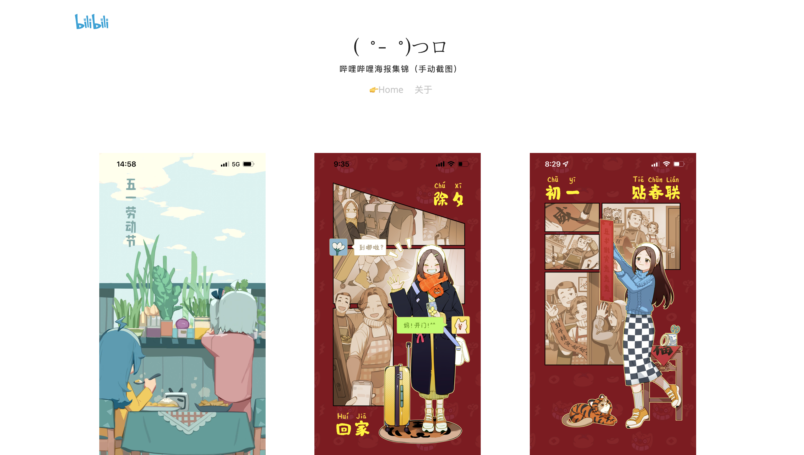
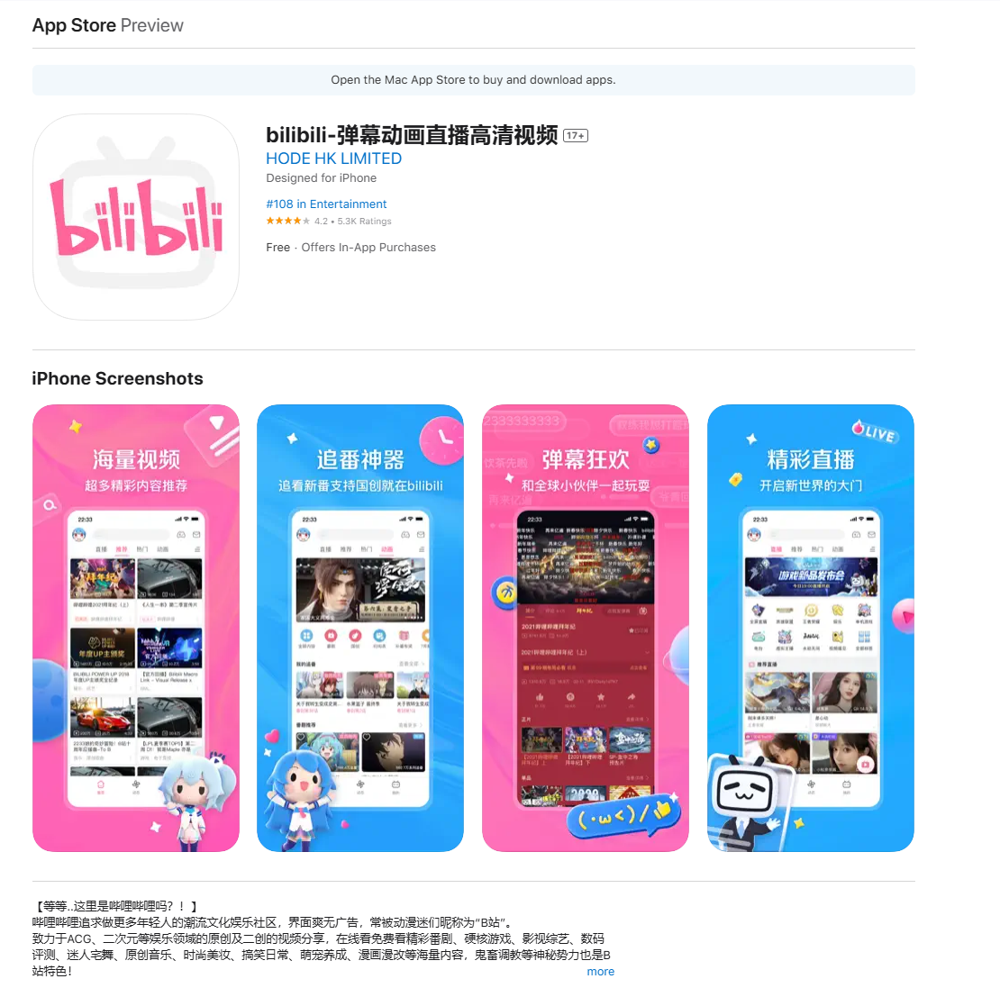

# bilibili_poster

  

**Bilibili Splash Illustrations** (or Posters) Collection:

> - Primary Bilibili API used: <https://app.bilibili.com/x/v2/splash/brand/list>
> - Web page source template: <https://codepen.io/tobiasdev/pen/zzEzVQ>

## About

As a dedicated Bilibili user, I open the app almost every day. I quickly noticed that for various holidays (including birthdays set in the app), Bilibili prepares special illustrations. To me, it has become a delightful daily surprise.

The vast majority of these illustrations are beautifully crafted. For instance, the 2022 Chinese New Year series in the screenshot above is designed in a comic-strip format, full of creativity. Over time, I saved quite a few screenshots on my phone, so I decided to build a website to showcase them all in one place. I also wrote a small script to automatically save the latest illustrations every day.

> [!TIP]  
> The secret to seeing splash illustrations every day:  
> The standard version of Bilibili typically displays ads on launch. It is recommended to use the Bilibili International version (with streamlined features: no video uploading, no membership shopping, and no splash ads).
> 

## License

Unlicense.

The code is adapted, the images belong to Bilibili, and this site is for sharing purposes only.
