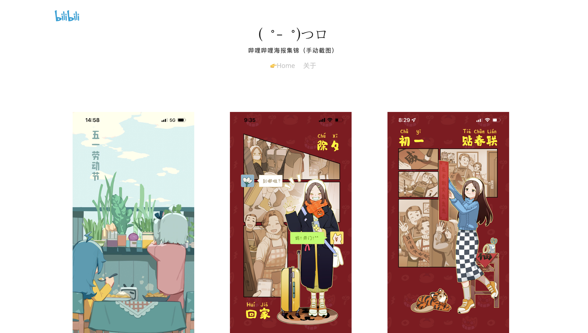
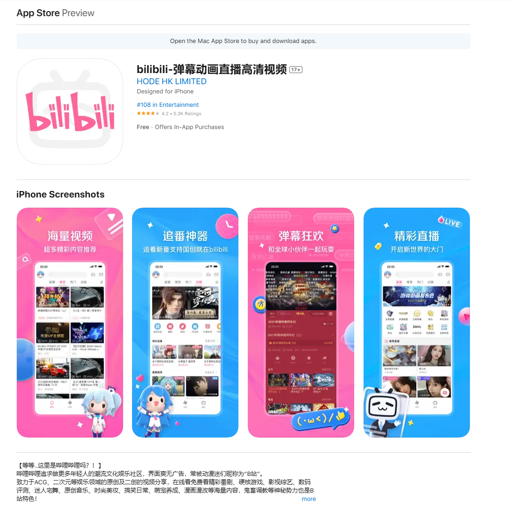

# bilibili_poster

**哔哩哔哩开屏插画**（或者叫海报）集锦：

> 主要使用的B站api：<https://app.bilibili.com/x/v2/splash/brand/list>, 网页源代码模版：<https://codepen.io/tobiasdev/pen/zzEzVQ>

## About

作为哔哩哔哩深度用户，我几乎每天都会打开B站。很快就我发现很多节假日（包括系统里填写的生日等）B站都会特别准备一个插画，对我来说算是每日的小惊喜。

其中绝大多数的插画都非常精美，比如上面这张截图里的2022春节系列，就做成了一个系列漫画的形式，新意十足。久而久之，手机里也保存了不少截图，于是搞了一个网站集中展示一下。顺便写了一个小脚本每天自动保存最新的插画。

> [!TIP]  
> 每日都能看到开屏插画的秘诀：  
> 通常版本的哔哩哔哩很大概率开屏就是广告，建议使用哔哩哔哩国际版（功能精简：无法投稿、会员购，无开屏广告）。
> 

## Liscense

Unlicense license.

代码是抄的，图片是哔哩哔哩的，本网站仅作分享。
